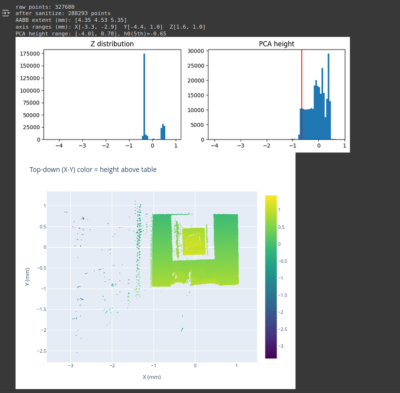
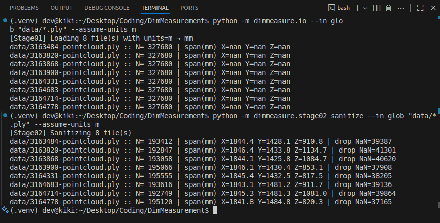
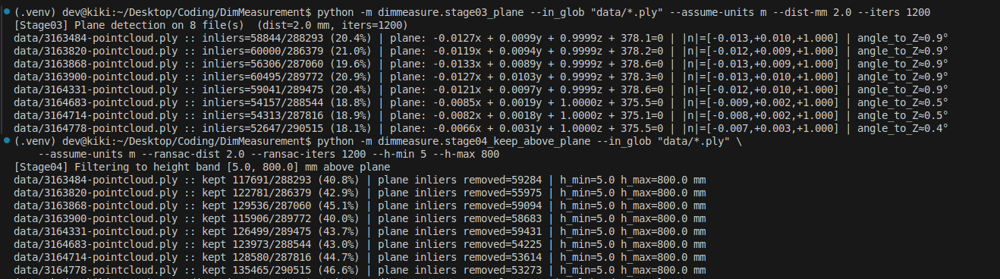
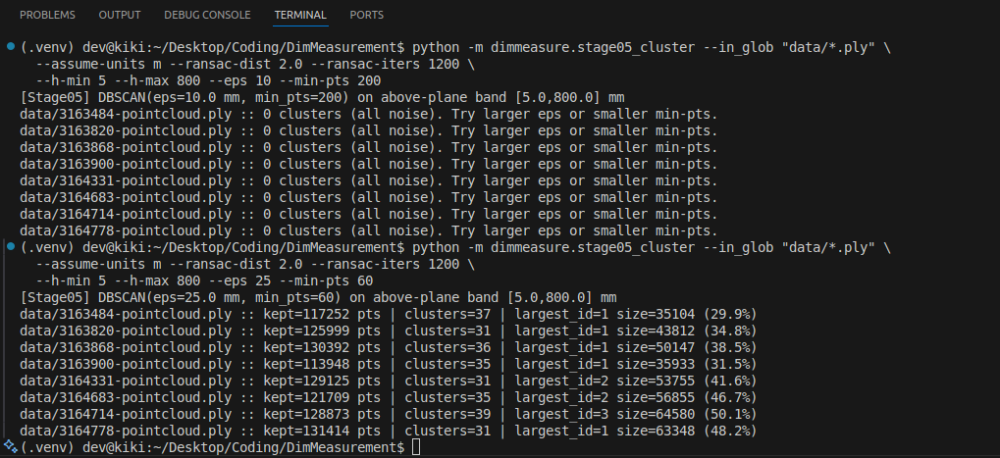

# Parcel Dimension Measurement – Status Update

## Overview
Handling `.ply` files — 3D **point clouds** of a parcel placed on an AGV and measuring those parcel boxes to find their dimensions and volume.

- **Point Cloud**: Essentially the simplest form of a 3d model. It is a collection of individual points plotted in a 3d space each point contains several measurements including its coordinate along **X, Y, Z directions, RGB (color value) and luminance (brightness).**

## Given
The dataset includes representative photos showing:
- Variation in parcel sizes
- Common shapes and surface textures
- Reflective or glossy packaging materials
- Color variations and potential overhangs or deformations
- Real-world placement on AGV top surfaces

## Data to be delivered per parcel:
- Length(mm)
- Width (mm)
- Height (mm)
- Timestamp in millisecond
- Parcel type (Box, polybag, etc.)
- Image with embossed measurements
- Box Volume and True Volume.

## Understanding the Raw Data

  

So what is the above graph say? From this, we can **spot the parcel’s footprint** and guess its height range.
- **Z distribution** — how points are spread along the scanner's vertical axis.
- **PCA height plot** — same data but aligned to the table plane using PCA (red line = estimated table height).
- **Top-down view** — X–Y plane colored by height above the table (yellow = top surfaces, purple = low).

## Current Progress (Stages 1–5)

1. **Stage01 - stage01_load.py**
   - Loads `.ply` point clouds
   - Handles unit scaling (meters → mm)

2. **Stage02 - stage02_sanitize.py**
   - Removes NaN values
   - Filters statistical outliers

  

3. **Stage03 - stage03_plane.py**
   - Detects ground plane using RANSAC
   - Checks orientation against Z-axis (angle ~0.5–0.9° → nearly flat)

4. **Stage04 - stage04_keep_above_plane.py**
   - Keeps points above the plane in a height band `[h_min, h_max]`
   - Ensures we focus only on parcel boxes as it should ;-;

  

5. **Stage05 - stage05_cluster.py**
   - DBSCAN clustering to isolate the parcel
   - Largest cluster corresponds to the box (30–50% points retained)

  

## Challenges Faced
- Initial span values were `NaN` → fixed by proper unit handling in Stage01.
- Plane detection required tuning `--dist-mm` and `--iters` for stable results.
- Above-plane filtering had to be balanced (`h_min`, `h_max`) to avoid grabbing background.
- DBSCAN clustering was tricky — started with all noise, later tuned (`eps=25, min_pts=60`) to get stable largest cluster.

### Technical Mistakes & Problems

## Why a Stage-Wise Pipeline?

Initially, mistakes and issues caused:
- **Preprocess**: mixed cleaning + filtering. Outliers and NaN values weren’t separated cleanly → led to inconsistent spans.
- **IO**: combined file I/O with processing logic → small bugs broke later steps.  
- **Main**:   - Debugging was impossible since we couldn’t isolate which stage (sanitize, plane, cluster) was failing. Parameter tuning was trial-and-error without visibility at intermediate steps.

So we switched to a **stage-by-stage pipeline**, where each step (load, sanitize, plane, filter, cluster) is isolated.  
This makes debugging easier, parameters tunable, and results traceable at every stage.

- **Monolithic code**: Tried handling I/O, cleaning, plane detection, and clustering in one file → debugging became impossible.
- **NaN span values**: Output showed `X=nan Y=nan Z=nan` until we separated loading (Stage01) from sanitization (Stage02).
- **Over-aggressive filtering**: Removing outliers too early caused loss of parcel points → fixed by a dedicated sanitize stage.
- **Plane misalignment**: Without an isolated plane detection step, results varied with background → added Stage03 with RANSAC tuning.
- **Height band confusion**: Mixed logic for plane removal and height filtering → separated into Stage04 to control `[h_min, h_max]`.
- **Clustering failures**: DBSCAN gave “0 clusters” when applied directly on raw data → resolved by making Stage05 only cluster points already above-plane.

### Outcome
Breaking the pipeline into **Stage01 → Stage05** allowed step-by-step debugging, parameter tuning, and reproducibility.  
This modular approach makes it easier to identify problems at each step and refine without breaking the whole flow.

## Next Steps (Milestone 2)
- **Stage06**: Fit Oriented Bounding Box (OBB) on the largest cluster.
- Extract Length, Width, Height.
- Compare with ground-truth dimensions and tune the parameters to fit the dimensions near the accuracy rate.
